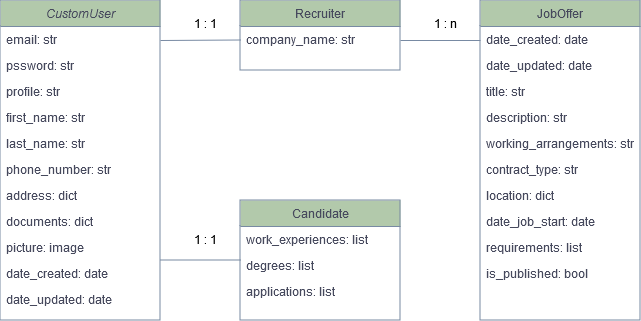
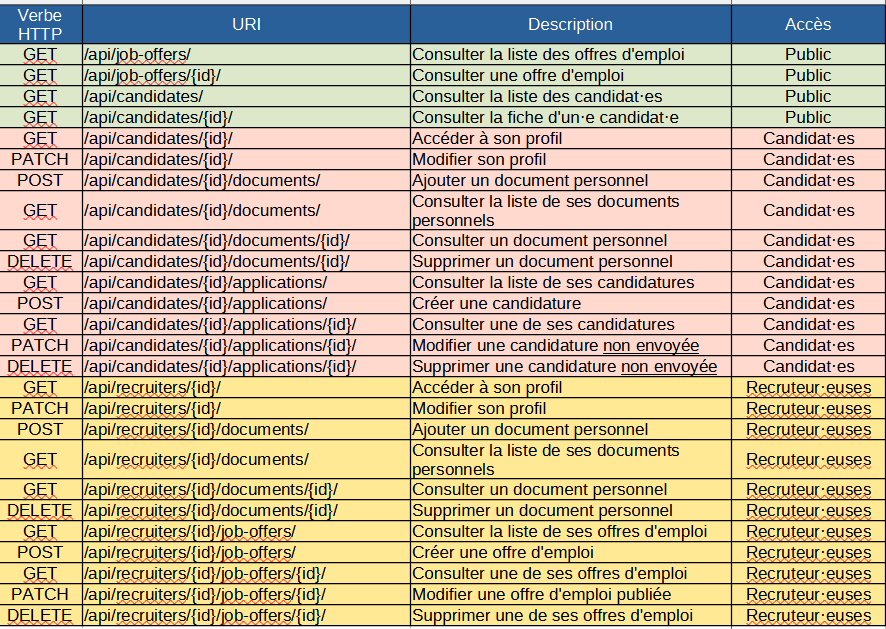
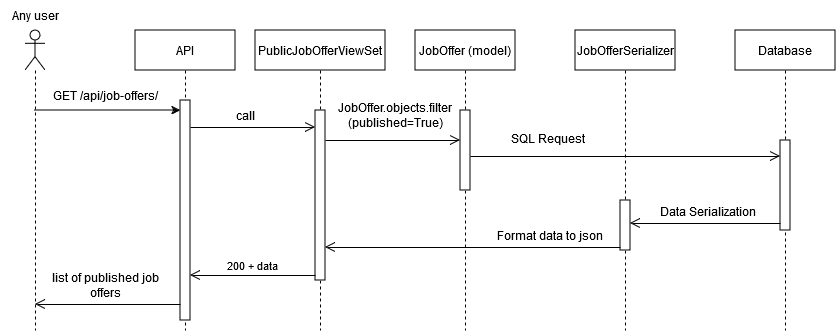

# API challenge
An exercise proposed by our CTO Ali to get to know each other.

## Prerequesites
- Python 3.12 or earlier installed on your computer
- [Git](https://git-scm.com/) installed on your computer
- an IDE like [PyCharm](https://www.jetbrains.com/pycharm/) or [VSCode](https://code.visualstudio.com/)
- Postgresql installed on your computer

## Clone the repository
Clone this repository with this terminal command `git clone https://github.com/salsififi/Ali_API_challenge`.

## Install project dependencies

### The easiest way: using uv
- If you don't have uv installed, install it with on of these methods: 
https://docs.astral.sh/uv/getting-started/installation/
- Go at the root of the project at its root (`cd API_challenge folder`).
- Run this command: `uv sync`. A virtual environnement will be created in a .venv folder, 
and all dependancies will be installed very quickly.

### If you don't want to use uv...
- At the root of the project, create a virtual environnement folder named .venv with terminal command 
`python -m venv .venv`.
- Install project dependancies with `pip install -r requirements.txt`.

## Create the .env file
- Create a .env file (still at the root of the project): `touch .env`.
- Edit this file with `DB_PASSWORD=<your-postgres-user-password>`
(replace the string after == by your postgres user password, which usually is postgres by default).

## Models chosen

- For users: CustomUser (general), Candidate, Recruiter
- For job offers: JobOffer

## API endpoints

## API documentation
- First launch project with `python manage.py runserver`.
- Then, in your browser, go to http://127.0.0.1:8000/swagger/.

## Sequence diagram
Use case: a user wants to see the published job offers.

## Context (Ali's instructions)

**Projet Backend dev**

Dans le cadre du développement de la plateforme mobile et Web sur la thématique recrutement, nous comptons exposer une API de type REST basée sur le framework Django/Python.

Les livrables du projet sont la réalisation d'une application Django/Python qui comprend :

- un ou plusieurs modèles liés à des tables dans une bases de données PostgreSQL
- un ou plusieurs Endpoints API dédiés au candidat afin de renseigner et consulter ses informations personnelles,
- un ou plusieurs Endpoints API dédiés au recruteur afin de consulter les informations des candidats,
- une interface OpenAPI de type swagger servant de documentation pour les developpeurs Frontend.

**Exigences**

- Utilisation de Visual Studio Code (VSCode) (sauf Simon).
- Conception du module avec des diagrammes UML sur DrawIO
- Suivi de la réalisation, du début jusqu'à la fin, sur un repo Github public.

